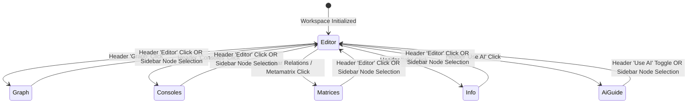

# Design: Left Sidebar Editor Tree and Header View Controls

## 1. Technical Approach & Architecture Overview

This change refines the navigation architecture of `innfo-editor` by clearly separating global workspace view navigation from model content exploration:

1. **Dedicated Tree Navigation in Left Sidebar**: The 3-tab view switcher (`editor`, `graph`, `consoles`) is removed from `LeftSidebar.vue`. The left sidebar becomes dedicated exclusively to the model/concept tree hierarchy and its associated model actions (expand/collapse all, metamatrix config, submodel inline expansion/focus).
2. **Top-Level View Controls in Header**: Workspace view controls for switching between `editor`, `graph`, and `consoles` move to `Header.vue`. They are rendered as a cohesive segmented button control with active indicators, tooltips, and responsive layout.
3. **Reactive Tree Node Selection**: Selecting any concept, element, or model node in the `LeftSidebar` tree reactively switches `activeView` to `'editor'` whenever the user is currently in `'graph'`, `'consoles'`, `'matrices'`, `'info'`, or any other non-editor view, immediately displaying and focusing the selected element in the editor.

```mermaid
flowchart TD
    subgraph HeaderBar ["Header.vue (Workspace Level Controls)"]
        HLogo["Logo & Workspace Actions"]
        HViews["View Switcher: [Editor] [Graph] [Consoles]"]
        HTools["Search / AI / Save / External"]
    end

    subgraph LeftPanel ["LeftSidebar.vue (Dedicated Content Tree)"]
        TreeControls["Expand / Collapse / Config"]
        ModelTree["Hierarchical Model & Concept Tree\n(Virtual Groups, Elements, Ghost Nodes, Relations)"]
    end

    subgraph CenterArea ["WorkspaceView.vue (Dynamic Main Viewport)"]
        EditorView["activeView === 'editor'\n(BlockSheet / BlockFeed / TextEditor / TreeEditor)"]
        GraphView["activeView === 'graph'\n(GraphViewer)"]
        ConsolesView["activeView === 'consoles'\n(ConsoleHubView)"]
        OtherViews["matrices | info | ai-guide"]
    end

    HViews -->|Click 'Editor'| EditorView
    HViews -->|Click 'Graph'| GraphView
    HViews -->|Click 'Consoles'| ConsolesView

    ModelTree -->|Click Node / Concept (selectNode)| UIStoreSync["uiStore.selectNode(id)"]
    UIStoreSync -->|Auto-transition activeView = 'editor'| EditorView
```

---

## 2. Architecture Decisions

### Decision 1: Relocation of Workspace View Controls from LeftSidebar to Header

- **Choice**: Relocate workspace view switching buttons (`editor`, `graph`, `consoles`) to `Header.vue`, leaving `LeftSidebar.vue` dedicated exclusively to the content tree.
- **Alternatives Considered**:
  - *Option A: Keep tabs in LeftSidebar*: Retain the horizontal tab switcher at the top of the sidebar.
    *Drawback*: Confuses the mental model: switching to "Graph" or "Consoles" replaces the central viewport while the sidebar still displayed the concept tree underneath the tab bar, creating visual redundancy and cluttering vertical sidebar space.
  - *Option B: Create a secondary floating navigation bar*: Add a floating or docked toolbar in the workspace area.
    *Drawback*: Consumes viewport real estate, creates visual inconsistency across different views, and fragments global workspace controls across multiple toolbars.
- **Rationale**: The Header is the primary anchor for application-level state and workspace tools (Save, Search, AI, Model info). Moving workspace view triggers into the Header aligns `innfo-editor` with standard IDE and modern productivity tool conventions (e.g. VS Code, Figma, Obsidian), where top headers host view modes while the left rail remains dedicated to directory/content navigation.

---

### Decision 2: Tree Node Selection as an Unambiguous Transition to Editor View

- **Choice**: Make `uiStore.selectNode(nodeId)` reset `activeView` to `'editor'` from any non-editor view (`graph`, `consoles`, `matrices`, `info`, `ai-guide`).
- **Alternatives Considered**:
  - *Option A: Only select the node in the background without changing `activeView`*: Let the user stay in Graph or Consoles view while the active node ID updates.
    *Drawback*: When viewing the Graph or Consoles, clicking a tree node in the left sidebar gives the impression that nothing happened, breaking the user's expectation that clicking a node opens its editor.
  - *Option B: Conditional transitions based on view type*: Switch to editor only from specific views, but not from others.
    *Drawback*: Inconsistent and unpredictable user experience.
- **Rationale**: Selecting a specific concept or node in the sidebar tree is an explicit user declaration of intent to inspect or edit that entity. Automatically returning to the editor matches the existing behavior established for the AI Guide and Validation Report overlay dismissals.

---

### Decision 3: Centralized View State Management via `uiStore`

- **Choice**: Encapsulate the view reset logic inside `uiStore.selectNode()` and `uiStore.setActiveView()` rather than scattering event handlers across individual Vue components.
- **Alternatives Considered**:
  - *Option A: Handle view transition only in `WorkspaceView.vue` event listeners*: Emit `select-node` from `LeftSidebar` and let `WorkspaceView.vue` call `uiStore.setActiveView('editor')`.
    *Drawback*: Bypasses view resets when node selection is triggered from breadcrumbs, keyboard shortcuts, or other components that call `uiStore.selectNode()` directly.
- **Rationale**: `uiStore` is the Single Source of Truth for UI state. Ensuring `selectNode` guarantees `activeView === 'editor'` enforces consistency across all invocation sites (Sidebar tree, Breadcrumbs, ModelHeader, Search dropdown, deep links).

---

## 3. Data Flow & Navigation State Machine



### Detailed Interaction Flows

1. **Header View Switching**:
   - User clicks `[Editor]`, `[Graph]`, or `[Consoles]` in `Header.vue`.
   - `Header.vue` calls `uiStore.setActiveView(view)`.
   - `WorkspaceView.vue` reactively switches the rendered central component (`BlockSheet`/`BlockFeed`/`TextEditor`/`TreeEditor` for `editor`, `GraphViewer` for `graph`, `ConsoleHubView` for `consoles`).
   - The corresponding button in `Header.vue` applies active styling (`bg-white dark:bg-slate-700 text-primary shadow-xs`).

2. **Sidebar Tree Interaction**:
   - While in `graph` or `consoles` view, user clicks a concept or element in the left sidebar tree.
   - `VirtualGroupNode` / `LeftSidebar` emits `select-node(nodeId)` and calls `uiStore.selectNode(nodeId)`.
   - `uiStore.selectNode()` sets `selectedNodeId.value = nodeId` and resets `activeView.value = 'editor'`.
   - Central viewport smoothly transitions back to `editor` displaying the selected node.
   - Header active button updates to `[Editor]`.

---

## 4. Detailed Component & File Changes

### 4.1 `LeftSidebar.vue`
[iNNfo/apps/innfo-editor/src/components/layout/LeftSidebar.vue](iNNfo/apps/innfo-editor/src/components/layout/LeftSidebar.vue)

- **Remove View Switcher**:
  - Delete the 3-button switcher container (`<!-- Navigation Switcher (Horizontal) -->` lines 16–63).
  - Remove unused icon imports if no longer referenced (`LayoutDashboard`, `Layers`).
- **Retain and Prioritize Tree**:
  - Breadcrumbs (`focused-model-breadcrumbs`), Workspace metrics header (`Workspace`, status pill, `expandAll`, `collapseAll`, `navigateToConfig`), and Model concept tree remain the sole content of the sidebar.
  - Sidebar layout becomes cleaner with reduced top padding.

---

### 4.2 `Header.vue`
[iNNfo/apps/innfo-editor/src/components/layout/Header.vue](iNNfo/apps/innfo-editor/src/components/layout/Header.vue)

- **Add Primary Workspace View Switcher**:
  - Insert a segmented button group for `editor`, `graph`, and `consoles` between the left workspace information/status section and the right action tools.
  - Buttons include clear icons (`FileText`, `LayoutDashboard`, `Layers`), labels, and `data-testid` attributes (`header-view-editor`, `header-view-graph`, `header-view-consoles`).
  - Active view button reflects `uiStore.activeView` with prominent active styles.
- **Template Structure**:
  ```html
  <!-- Primary Workspace View Switcher -->
  <div
    v-if="hasRootNode"
    class="flex items-center gap-1 p-0.5 rounded-lg bg-slate-100 dark:bg-slate-800 border border-slate-200/80 dark:border-slate-700/80 shrink-0"
    data-testid="header-view-switcher"
  >
    <button
      class="flex items-center gap-1.5 px-2.5 py-1 text-xs font-semibold rounded-md transition-all cursor-pointer capitalize border border-transparent"
      :class="
        uiStore.activeView === 'editor'
          ? 'bg-white dark:bg-slate-700 text-primary shadow-xs'
          : 'text-slate-500 dark:text-slate-400 hover:text-slate-700 dark:hover:text-slate-200'
      "
      @click="uiStore.setActiveView('editor')"
      data-testid="header-view-editor"
      title="Editor View"
    >
      <FileText class="w-3.5 h-3.5 shrink-0" />
      <span>Editor</span>
    </button>

    <button
      class="flex items-center gap-1.5 px-2.5 py-1 text-xs font-semibold rounded-md transition-all cursor-pointer capitalize border border-transparent"
      :class="
        uiStore.activeView === 'graph'
          ? 'bg-white dark:bg-slate-700 text-primary shadow-xs'
          : 'text-slate-500 dark:text-slate-400 hover:text-slate-700 dark:hover:text-slate-200'
      "
      @click="uiStore.setActiveView('graph')"
      data-testid="header-view-graph"
      title="Graph View"
    >
      <LayoutDashboard class="w-3.5 h-3.5 shrink-0" />
      <span>Graph</span>
    </button>

    <button
      class="flex items-center gap-1.5 px-2.5 py-1 text-xs font-semibold rounded-md transition-all cursor-pointer capitalize border border-transparent"
      :class="
        uiStore.activeView === 'consoles'
          ? 'bg-white dark:bg-slate-700 text-primary shadow-xs'
          : 'text-slate-500 dark:text-slate-400 hover:text-slate-700 dark:hover:text-slate-200'
      "
      @click="uiStore.setActiveView('consoles')"
      data-testid="header-view-consoles"
      title="Workspace Consoles & Hub"
    >
      <Layers class="w-3.5 h-3.5 shrink-0" />
      <span>Consoles</span>
    </button>
  </div>
  ```
- **Icon Imports**: Add `FileText`, `LayoutDashboard`, and `Layers` to the `lucide-vue-next` imports.

---

### 4.3 `uiStore.ts`
[iNNfo/apps/innfo-editor/src/stores/uiStore.ts](iNNfo/apps/innfo-editor/src/stores/uiStore.ts)

- **Update `selectNode`**:
  - Extend the view-reset behavior: whenever `selectNode(id)` is called with a non-null node id (or on any selection), if `activeView.value !== 'editor'`, set `activeView.value = 'editor'`.
  ```typescript
  function selectNode(id: string | null): void {
    selectedNodeId.value = id
    showValidationReport.value = false
    if (activeView.value !== 'editor') {
      activeView.value = 'editor'
    }
  }
  ```

---

### 4.4 `WorkspaceView.vue`
[iNNfo/apps/innfo-editor/src/views/WorkspaceView.vue](iNNfo/apps/innfo-editor/src/views/WorkspaceView.vue)

- **Simplify Selection Handlers**:
  - `onSelectNode(nodeId)` calls `uiStore.selectNode(nodeId)`. Since `uiStore.selectNode` handles resetting `activeView` to `'editor'`, redundant view checking in `WorkspaceView.vue` can be safely simplified.

---

## 5. Interfaces & Component Contracts

### 5.1 `uiStore` State & Actions Contract

| Action / Property | Type | Description |
| :--- | :--- | :--- |
| `activeView` | `Ref<ActiveView>` | Active viewport view: `'editor' \| 'explorer' \| 'graph' \| 'matrices' \| 'info' \| 'consoles' \| 'ai-guide'` |
| `setActiveView(view: ActiveView)` | `(view: ActiveView) => void` | Updates active view |
| `selectNode(id: string \| null)` | `(id: string \| null) => void` | Sets `selectedNodeId`, dismisses validation overlay, and resets `activeView` to `'editor'` |

### 5.2 Test ID Contract

| Test ID | Component | Role |
| :--- | :--- | :--- |
| `header-view-switcher` | `Header.vue` | Container for the 3 primary view buttons |
| `header-view-editor` | `Header.vue` | Triggers `activeView = 'editor'` |
| `header-view-graph` | `Header.vue` | Triggers `activeView = 'graph'` |
| `header-view-consoles` | `Header.vue` | Triggers `activeView = 'consoles'` |
| `left-sidebar` | `LeftSidebar.vue` | Left sidebar container (no view switcher tabs inside) |
| `model-header` | `LeftSidebar.vue` | Root model header in the tree |
| `virtual-group-node` | `VirtualGroupNode.vue` | Concept group node in the tree |

---

## 6. Testing Strategy

### 6.1 Unit Tests
- **`tests/unit/uiStore-selectNode.test.ts`**:
  - Update tests to verify that `selectNode` resets `activeView` to `'editor'` when current `activeView` is `'graph'`, `'consoles'`, `'matrices'`, `'info'`, or `'ai-guide'`.
  - Verify that `selectNode` preserves `activeView = 'editor'` when already in editor.

### 6.2 Component Tests
- **`tests/component/Header.test.ts`**:
  - Add test suite for Header view switcher:
    - Renders buttons for `editor`, `graph`, and `consoles` when a root node is loaded.
    - Clicking `header-view-graph` sets `uiStore.activeView` to `'graph'`.
    - Clicking `header-view-consoles` sets `uiStore.activeView` to `'consoles'`.
    - Clicking `header-view-editor` sets `uiStore.activeView` to `'editor'`.
    - Active view button has active indicator class (`text-primary`, `bg-white dark:bg-slate-700`).
- **`tests/component/LeftSidebar-navigation.test.ts`**:
  - Update tests to verify that `view-switcher-editor`, `view-switcher-graph`, and `view-switcher-consoles` do **not** exist in `LeftSidebar`.
  - Verify `LeftSidebar` permanently renders the model and concept tree.

### 6.3 Verification Commands
```bash
# Run unit & component tests in innfo-editor
pnpm --filter innfo-editor test:run
```

---

## 7. Risk Analysis & Mitigation

| Risk | Likelihood | Impact | Mitigation |
| :--- | :--- | :--- | :--- |
| **Header crowding on narrow viewports** | Low | Low | The view switcher uses compact padding (`px-2.5 py-1`), standard font sizes, and responsive flex layout with `shrink-0`. |
| **Unexpected view switch when clicking tree** | Low | Low | Standard IDE paradigm: clicking a file/concept tree item consistently opens its editor view. |
| **Existing test regressions** | Medium | Low | Explicitly update tests asserting sidebar switcher buttons (`LeftSidebar-navigation.test.ts`) and create corresponding `Header.test.ts` test coverage. |

---

## 8. Rollback Plan

If regressions occur:
1. Revert changes to `LeftSidebar.vue`, `Header.vue`, `uiStore.ts`, and `WorkspaceView.vue`.
2. Run `pnpm --filter innfo-editor test:run` to confirm baseline test suite passes.
