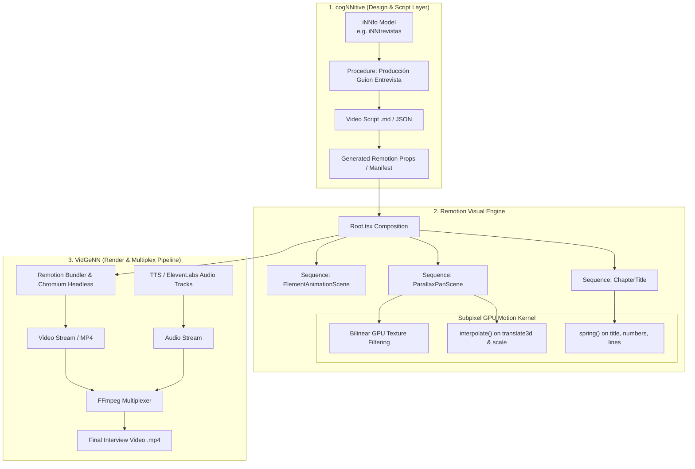

# SDD Design: Remotion Video Scenes & Parallax Motion Pipeline

## 1. System Architecture Diagram



---

## 2. Component Design & Prop Interfaces

### `ChapterTitleProps`
```typescript
export interface ChapterTitleProps {
  label?: string;            // Default: "CAPÍTULO"
  chapterNumber?: string;     // e.g. "01", "02"
  title: string;             // e.g. "El Descubrimiento Accidental"
  accentColor?: string;      // e.g. "#3b82f6" | "#059669"
  theme?: "dark" | "light";   // Default: "dark"
}
```

### `ParallaxPanSceneProps`
```typescript
export interface ParallaxPanSceneProps {
  imageUrl: string;
  foregroundUrl?: string;
  enableAmbientBackground?: boolean;
  direction?: "left-to-right" | "right-to-left" | "diagonal-up" | "zoom-in";
  panDistance?: number;
  initialScale?: number;
  targetScale?: number;
  title?: string;
  subtitle?: string;
  speakerTag?: string;
  accentColor?: string;
}
```

---

## 3. Script Declaration Schema

In interview scripts (`_produccion_guiones_entrevista.md` / `*.anydeo.md`), scenes are declared sequentially:

```markdown
# NN Scene: Capitulo 1 Intro
scene_type:: chapter_title
chapter_number:: 01
chapter_title:: El Hallazgo en el Laboratorio
duration_seconds:: 3.0
voiceover:: Capítulo uno: El hallazgo en el laboratorio.

# NN Scene: Fleming en el Laboratorio
scene_type:: image_motion
image:: assets/innovacion/La Penicilina/image.png
motion_direction:: left-to-right
speaker:: Alexander Fleming
title:: Alexander Fleming • Londres, 1928
subtitle:: Una placa de Petri contaminada reveló el principio activo.
duration_seconds:: 6.0
audio:: audio/scene_01_fleming.mp3
```

---

## 4. Integration with VidGeNN Pipeline

1. **Script Parsing:** VidGeNN parses the script into an array of typed `SceneDescriptor` objects.
2. **Dynamic Composition Builder:** Generates or hydrates the Remotion entry point:
   ```tsx
   export const InterviewComposition = ({ scenes }) => {
     let currentFrame = 0;
     return (
       <AbsoluteFill>
         {scenes.map((scene, idx) => {
           const from = currentFrame;
           const duration = Math.ceil(scene.duration_seconds * 30);
           currentFrame += duration;
           return (
             <Sequence key={idx} from={from} durationInFrames={duration}>
               {renderSceneComponent(scene)}
             </Sequence>
           );
         })}
       </AbsoluteFill>
     );
   };
   ```
3. **Execution Command:**
   ```bash
   npx remotion render Root out/video_visuals.mp4 --concurrency=4
   ffmpeg -i out/video_visuals.mp4 -i out/master_audio.mp3 -c:v copy -c:a aac -shortest final_interview.mp4
   ```
