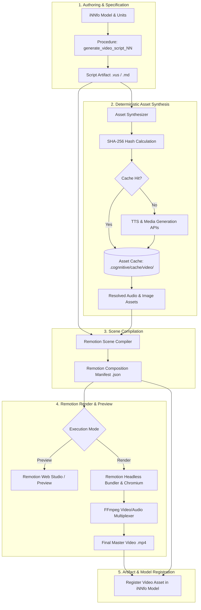

# Technical Design: Integrate cogNNitive Video Engine

## 1. System Overview & Technical Approach

The **cogNNitive Video Engine** (`cognnitive-video-engine`) is an internal, self-contained video authoring, asset synthesis, and programmatic rendering subsystem embedded directly within cogNNitive. It absorbs the core visual scene compilation, text-to-speech (TTS) synthesis, media retrieval, and Remotion rendering pipeline previously hosted in the external Tauri/Rust VidGeNN application.

By unifying video production into the standard cogNNitive tool and procedure lifecycle:
- Users interactively produce scripts and direct video assembly via natural language conversation and structured iNNfo procedures.
- The video engine executes headlessly via standard Node.js / TypeScript CLI scripts or serves local web previews (`npx remotion preview`) without requiring desktop GUI shells, Tauri binaries, or manual slider inputs.
- Audio and media assets are synthesized deterministically and cached via content-derived SHA-256 hashes, eliminating redundant third-party API costs and maximizing render throughput.

---

## 2. Architectural Decisions

```
+-------------------------------------------------------------------------+
|                    Architectural Decision Highlights                   |
+-------------------------------------------------------------------------+
| 1. Tool vs Plugin     | First-class Tool within iNNfo Template Ontology |
| 2. Remotion Engine    | Headless CLI Bundling & Local Web Preview Server|
| 3. Caching Subsystem  | Deterministic SHA-256 Content-Addressed Storage |
| 4. Decoupling         | Pure Node.js/TS Runtime (No Tauri/Rust/Desktop) |
+-------------------------------------------------------------------------+
```

### 2.1 Tool within iNNfo Template Ontology
- **Decision**: Video rendering and script generation are structured as internal **Tools** invoked by Template **Procedures** (`Procedures -> Work -> Tools -> Artifacts`).
- **Rationale**: In cogNNitive's ontology, procedures guide agent execution steps, while tools perform deterministic, reproducible operations. Embedding `cognnitive-video-engine` as a tool runtime enables any template (e.g. `video`, `interview`, `learning`) to trigger video compilation without custom plugin registration or external processes.

### 2.2 Remotion CLI Bundling & Web Preview
- **Decision**: Leverage Remotion's headless CLI (`@remotion/bundler` and `@remotion/renderer`) for production rendering, with optional local development previews via `remotion preview`.
- **Rationale**: Headless execution runs reliably across CI/CD, developer terminals, and background agent sessions. Providing a lightweight local preview command allows creators to inspect frame-accurate animations in their browser on demand.

### 2.3 Deterministic SHA-256 Asset Caching
- **Decision**: All synthesized media (TTS voiceovers, AI images, motion backgrounds) are indexed in `.cognnitive/cache/video/` using SHA-256 hashes computed from their normalized prompts, voice settings, and metadata.
- **Rationale**: Video production is an iterative process. Minor edits to scene 4 must not trigger re-synthesis of scenes 1-3. Content-addressable caching guarantees instant cache hits for unchanged segments.

### 2.4 Decoupling from Tauri & Desktop Bindings
- **Decision**: Eliminate all dependencies on Tauri IPC, Webview windows, and Rust native code. Standardize on pure Node.js / ES Modules (`.mjs` / `.ts`) and standard `ffmpeg` binaries.
- **Rationale**: Eliminates cross-compilation overhead, OS-specific window management issues, and installation friction for cogNNitive developers.

---

## 3. Data Flow Architecture



### Execution Steps:
1. **Script Authoring**: The agent or user drafts a script artifact (`.vus` or markdown) following the `video` template schema with timeline scenes, overlays, and visual cues.
2. **Asset Synthesis & Cache Resolution**: For each scene, TTS voiceover text and media generation prompts are extracted. The SHA-256 hash is computed. If cached, local files are returned; otherwise, generators synthesize the assets and write them to the cache.
3. **Manifest Compilation**: `RemotionSceneCompiler` validates all assets, measures precise audio durations, aligns frame numbers (at 30 or 60 FPS), and emits a typed `RemotionCompositionManifest`.
4. **Render / Preview**: The manifest is fed into Remotion:
   - For interactive review: `npx remotion preview` starts a local preview server.
   - For final delivery: `cognnitive-video render` executes headless compilation and outputs the finalized MP4.
5. **Asset Registration**: Final MP4 paths, manifest files, and thumbnail outputs are recorded in the target iNNfo model.

---

## 4. Interfaces & Contracts

### 4.1 Remotion Composition Manifest Schema

```typescript
export interface RemotionCompositionManifest {
  version: "1.0.0";
  compositionId: string;
  fps: number;
  width: number;
  height: number;
  totalDurationInFrames: number;
  totalDurationInSeconds: number;
  tracks: {
    scenes: RemotionSceneTrack[];
    audio: AudioTrackBinding[];
    overlays: VisualOverlayConfig[];
  };
  metadata: {
    generator: "cogNNitive Video Engine";
    generatedAt: string;
    scriptSource: string;
  };
}

export interface RemotionSceneTrack {
  id: string;
  sceneType: "chapter_title" | "image_motion" | "kinetic_text" | "concept_diagram" | "split_screen";
  fromFrame: number;
  durationInFrames: number;
  props: Record<string, unknown>;
  transition?: {
    type: "fade" | "slide-left" | "slide-right" | "wipe" | "none";
    durationInFrames: number;
  };
}

export interface AudioTrackBinding {
  id: string;
  sceneId: string;
  assetPath: string;
  fromFrame: number;
  durationInFrames: number;
  volume: number;
  sha256: string;
}

export interface VisualOverlayConfig {
  id: string;
  type: "lowerThird" | "kineticTitle" | "conceptCallout";
  fromFrame: number;
  durationInFrames: number;
  config: LowerThirdProps | KineticTitleProps | ConceptCalloutProps;
}

export interface LowerThirdProps {
  title: string;
  subtitle?: string;
  speakerTag?: string;
  accentColor?: string;
  position?: "bottom-left" | "bottom-right" | "bottom-center";
}

export interface KineticTitleProps {
  heading: string;
  subheading?: string;
  theme?: "dark" | "light" | "accent";
  animationStyle?: "pop" | "typewriter" | "spring-up";
}

export interface ConceptCalloutProps {
  label: string;
  description: string;
  icon?: string;
  highlightColor?: string;
}
```

### 4.2 Asset Synthesis & Cache Manager Interfaces

```typescript
export interface AssetSynthesisRequest {
  type: "tts" | "image" | "motion_background";
  promptOrText: string;
  options: Record<string, unknown>;
}

export interface AssetSynthesisResult {
  assetPath: string;
  sha256: string;
  fromCache: boolean;
  durationSeconds?: number;
  fileSizeBytes: number;
}

export interface ICacheManager {
  computeHash(content: string, options?: Record<string, unknown>): string;
  has(hash: string, extension: string): Promise<boolean>;
  get(hash: string, extension: string): Promise<string | null>;
  put(hash: string, extension: string, buffer: Buffer): Promise<string>;
  getCacheDir(): string;
}

export interface IAssetSynthesizer {
  synthesizeTTS(text: string, voiceOptions: Record<string, unknown>): Promise<AssetSynthesisResult>;
  resolveMedia(prompt: string, mediaOptions: Record<string, unknown>): Promise<AssetSynthesisResult>;
}
```

### 4.3 CLI Runner Contracts

```typescript
export interface VideoCompileOptions {
  scriptPath: string;
  outputPath?: string;
  fps?: number;
  width?: number;
  height?: number;
  cacheDir?: string;
}

export interface VideoRenderOptions extends VideoCompileOptions {
  manifestPath?: string;
  outputVideoPath: string;
  concurrency?: number;
  quality?: number;
}

export interface VideoPreviewOptions {
  manifestPath: string;
  port?: number;
}

export interface RenderSummary {
  outputVideoPath: string;
  totalDurationSeconds: number;
  totalFrames: number;
  renderTimeMs: number;
  cachedAssetsUsed: number;
  newAssetsSynthesized: number;
}
```

---

## 5. File Changes & Project Layout

```
cogNNitive/
|-- skills/
|   `-- nn-video-script/
|       |-- SKILL.md                                 # [MODIFIED] Rebrand to cogNNitive Video & reference CLI engine
|       |-- scripts/
|       |   |-- vus-parse.mjs                        # [EXISTING] VUS parser
|       |   |-- vus-spec.mjs                         # [EXISTING] VUS schema validator
|       |   |-- remotion-scene-compiler.mjs          # [NEW] Compiles VUS/MD script to Remotion Manifest
|       |   |-- cache-manager.mjs                    # [NEW] Deterministic SHA-256 asset cache manager
|       |   |-- asset-synthesizer.mjs                # [NEW] TTS & media synthesis provider integration
|       |   |-- video-engine-cli.mjs                 # [NEW] CLI entrypoint for compile, render, and preview
|       |   `-- finalize-video.mjs                   # [MODIFIED] Uses internal video-engine-cli
|       `-- test/
|           |-- scene-compiler.test.mjs              # [NEW] Unit tests for Remotion compilation
|           |-- cache-manager.test.mjs               # [NEW] Unit tests for SHA-256 caching
|           `-- video-engine-cli.test.mjs            # [NEW] Integration test for CLI execution
|-- iNNfo/
|   `-- specs/
|       `-- templates/
|           `-- video/
|               |-- spec_NN.md                       # [MODIFIED] Rebrand VidGeNN/Anydeo -> cogNNitive Video
|               `-- procedures/
|                   |-- generate_video_script_NN.md  # [NEW] Canonical video generation procedure
|                   `-- generate_anydeo_script_NN.md # [MODIFIED] Deprecation redirect to generate_video_script_NN.md
`-- openspec/
    `-- changes/
        `-- integrate-cognnitive-video-engine/
            |-- proposal.md                          # [EXISTING] Change proposal
            |-- design.md                            # [NEW] Technical architecture & design
            `-- specs/
                |-- cognnitive-video-engine/
                |   `-- spec.md                      # [EXISTING] Engine spec
                `-- video-template/
                    `-- spec.md                      # [EXISTING] Video template delta spec
```

---

## 6. Testing & Validation Strategy

### 6.1 Unit Testing: Remotion Scene Compiler
- **Manifest Accuracy**: Verify parsing a multi-scene VUS script produces correct `tracks.scenes`, `tracks.audio`, and `tracks.overlays`.
- **Frame Math**: Verify frame calculations: $\text{frames} = \lceil\text{durationInSeconds} \times \text{FPS}\rceil$, cumulative `fromFrame` offset integrity, and zero timeline gaps.
- **Overlay Validation**: Assert all lower-thirds, kinetic titles, and callouts receive exact start frame, duration, and styling parameters.

### 6.2 Unit Testing: Cache Manager
- **Deterministic Hashing**: Verify identical input text + voice settings produce the exact same SHA-256 hash across runs and operating systems.
- **Hit vs Miss Behavior**:
  - Unseen hash produces a cache miss -> saves synthesized file -> returns `fromCache: false`.
  - Re-requesting the same hash produces a cache hit -> returns existing path -> `fromCache: true`.
- **Cache Invalidation & Isolation**: Verify cache directories segregate TTS, images, and video temp files.

### 6.3 Integration & Procedure Testing
- **End-to-End Headless Render**: Run `video-engine-cli.mjs render` on a sample 2-scene script. Assert the process produces a valid MP4 file and the reported duration matches manifest calculation.
- **Procedure Resolution & Deprecation**: Validate that executing `generate_anydeo_script_NN.md` logs a deprecation warning and seamlessly invokes `generate_video_script_NN.md`.
- **Naming Cleanliness**: Automated scan across `iNNfo/specs/templates/video/` and `skills/nn-video-script/` verifying zero unmapped `Anydeo` or `VidGeNN` occurrences.
